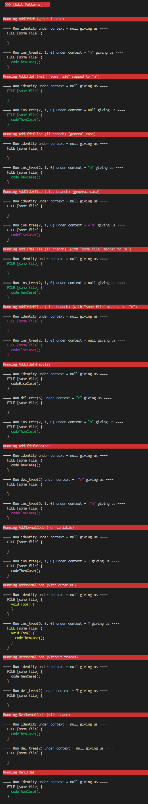

## Installation Instructions

As explained in the [REQUIREMENTS.md](REQUIREMENTS.md), the [_Stack_][stack] build system is our only installation requirement.
You can install it yourself or use the [Dockerfile](Dockerfile).

### Option 1: Manual Setup
First, please install Stack.
Detailed installation instructions for many operating systems are given on the respective [installation webpage][stackinstall].

- Linux: You can install stack via `curl -sSL https://get.haskellstack.org/ | sh` or `wget -qO- https://get.haskellstack.org/ | sh` (Alternatively, if you are using an Ubuntu-based distro, you can get it with apt `sudo apt-get install haskell-stack`, or `sudo pacman -S stack` if you are using an Arch-based distro).
Further instructions for installing stack including specific linux distributions are given [here][stackinstall].
- Windows 64-bit: Go to the [stack installation page][stackinstall]. Download and run the _Windows 64-bit Installer_.
- MacOS: Please follow the instructions on the [installation webpage][stackinstall].

Second, please open a terminal and navigate to the repository's directory (the directory containing this `INSTALL.md`).
```shell
cd <path/to/this/repository>
```
Before running the demo you should update and upgrade stack as you might get errors otherwise:
```shell
stack update
stack upgrade
```
Our demo prints coloured text to the terminal, so it might not be compatible with every terminal.
We tested it within the Windows Terminal, Windows Powershell, Windows Subsystem for Linux (WSL), and the default terminal on Manjaro.
You can then build the library and run the demo as follows:
```shell
stack run
```

### Option 2: Setup via Dockerfile

First, install [Docker](https://www.docker.com/).
Second, open a terminal and navigate to the repository's directory (the directory containing this `INSTALL.md`).
```shell
cd <path/to/this/repository>
```
Third, create the docker image:
```shell
docker build -t ftr .
```
You can verify that the image was created successfully by running
```shell
docker images
```
and checking that an image called `ftr` is listed.
Fourth, you can run the image and thus the demo:
```shell
docker run -t ftr
```

## What Is There to See
Our demo runs several independent examples.
Each example is separated by a red headline and consists of a series of edits applied to a source code fragment.
For each edit, we first show its type and the feature context under which that edit was made:

    ==== Run ins_tree(11, 4, 0) under context = "SafeStack" giving us ====

where an abstract syntax tree (AST) whose root has ID 11 is inserted below node 4 in the current AST at index 0 under feature context "SafeStack".
(The first edit will always be `identity` under context `null`. This is a technical detail necessary to show the initial state of the example.)
Afterwards, the code that is a result of this edit is shown, similar to Figure 1 in the paper:


## Expected Output / If You Cannot Get it Running

By default, the following examples are executed in this order:

1. Motivating example
    - Alice's part of the motivating example shown in Figure 1 in the paper.
    - Bob's part of the motivating example shown in Figure 3 in the paper. As the synchronisation of code and feature traces across clones is subject to future work, this example simulates how we envision the synchronisation.
2. Examples of edit patterns from the evaluation (Section 5): For each pattern we show how to reproduce it in the general case and when an outer scope (eg., a method) is already assigned the target mapping. We omitted AddIfdef* as it is just a repitition of AddIfdef with arbitrary contexts and code fragments. As AddIfdefElse has to be reproduced using two variants, we need two different examples here, one for the if-branch and one for the else-branch.

If you see the following output after `stack run` (or when running the Dockerfile), the build process and execution of the demo were successful.
The colours in your terminal might deviate from the following screenshots.
The following screenshots also display the entire default output of the demo in case you were not able to install the stack or get the demo running.

First, the output for Figure 1 in the paper is shown. Alice performs several edits to the `pop` method.


Second, the propagation of Alice's changes to Bob's variant is shown. As the synchronisation of code and feature traces across clones is subject to future work, this example simulates how we envision the synchronisation.


Third, our tool reproduces the edit patterns described in the paper (Section 5).


[stack]: https://docs.haskellstack.org/en/stable/README/
[stackinstall]: https://docs.haskellstack.org/en/stable/install_and_upgrade/
