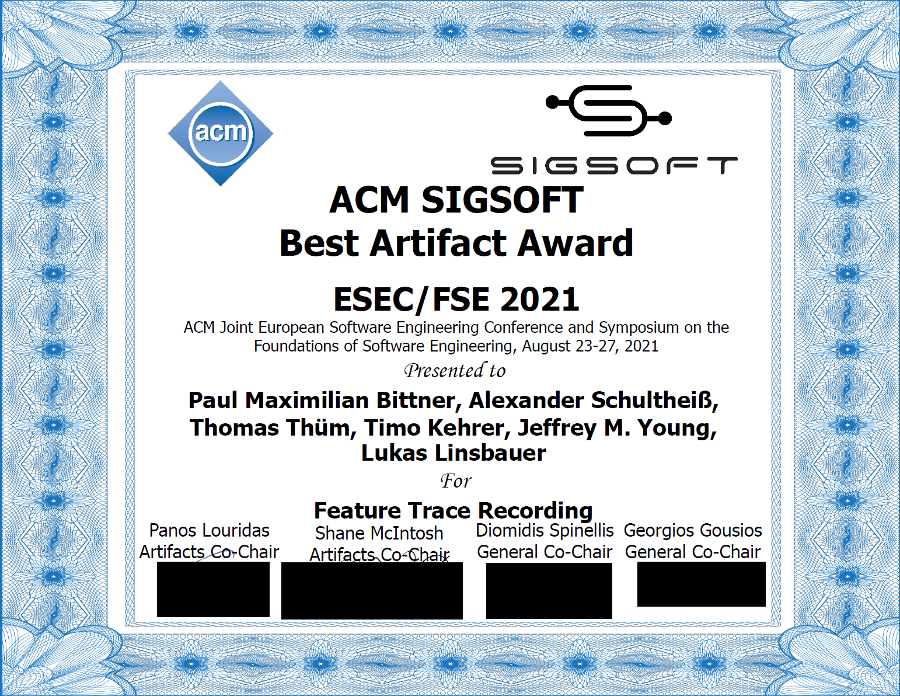
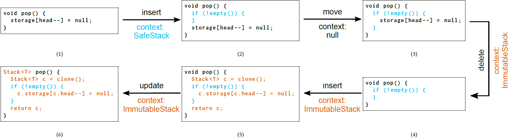
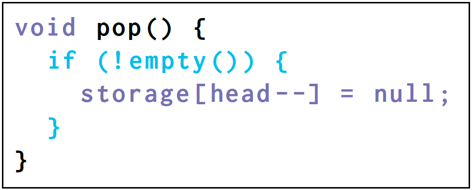

# Feature Trace Recording

[](https://2021.esec-fse.org/info/awards)

[][paper]

[](https://www.haskell.org/)
[][preprint]
[][documentation]
[][talk]
[](https://travis-ci.com/pmbittner/FeatureTraceRecording)
[](INSTALL.md)
[][website]
[](LICENSE.LGPL3)
[](https://doi.org/10.5281/zenodo.4900682)
<!-- [](STATUS.md) -->

Artifact repository for the paper _Feature Trace Recording_, accepted at _ESEC/FSE 2021_.
Authors are [Paul Maximilian Bittner][paul], [Alexander Schultheiß][alexander], [Thomas Thüm][thomas], [Timo Kehrer][timo], [Jeffrey M. Young][jeffrey], and [Lukas Linsbauer][lukas].

The artefact mainly consists of a library written in the Haskell language that implements feature trace recording.
The library is accompanied with a demo application that uses the library to reproduce our motivating example (Alice and Bob using feature trace recording in Section 2 in our paper) as well as examples of the edit patterns we used to evaluate feature trace recording (Section 5).


## What is Feature Trace Recording?

Feature trace recording is a semi-automated method for recording feature-to-code mappings during software development.
It unlocks evolution as a new source of information for feature location.


<!--  -->

Consider a developer Alice editing the `pop` method of a `Stack` class in Java as depicted in the image above.
Feature-to-code mappings are indicated by corresponding colours.
By labeling her edits with the feature she edits, we derive feature mappings for edited source code.
We refer to such a label as [_feature context_](https://pmbittner.github.io/FeatureTraceRecording/docs/FeatureTraceRecording.html#t:FeatureContext).
It can be left empty when developers do not know the feature they edit.
In our example, Alice does not know the feature of the moved line in her second edit and omits the feature context (i.e., sets it to null).

From feature contexts we can compute feature mappings for the current code base but also for other variants.
Assume there is a second developer, Bob, working on another variant (e.g., branch or fork) of the software.
Bob’s variant might implement other features than Alice’s.
Assume Bob’s variant implements the blue feature <span style="color:#00BEEB">SafeStack</span> but not the orange feature <span style="color:#D95F02">ImmutableStack</span>.
Although Alice made many edits to <span style="color:#D95F02">ImmutableStack</span>, we can still derive feature mappings for Bob’s code.
When Alice deletes code from <span style="color:#D95F02">ImmutableStack</span>, we can infer that this code does not belong to <span style="color:#D95F02">ImmutableStack</span> anymore.
We thus introduce the new feature mapping <span style="color:#7570B3">¬ImmutableStack</span> for the deleted code that is still present in Bob’s variant (highlighted in purple):



A detailed explanation of this example can be found in our [paper][paper] and [preprint][preprint].

Feature trace recording is the first step towards our vision for bridging the gap between clone-and-own and software product lines in our project [VariantSync][variantsync].
You may read about it in our [ICSE NIER paper](https://tinyurl.com/variantsync) or watch our talk on [YouTube](https://www.youtube.com/watch?v=oJf8W4cE25A) :blush:.


## How to Run the Demo
Our library is written in Haskell and uses the _Stack_ build system (see [REQUIREMENTS.md](REQUIREMENTS.md)).
Instructions for installing Stack, building our library and running the demo are given in the [INSTALL.md](INSTALL.md).


## [Documentation][documentation]

A detailed documentation can be found in `docs/index.html` and can be browsed on the [Github page][documentation].

Some interesting code locations are:
- [`main`](https://pmbittner.github.io/FeatureTraceRecording/docs/Main.html#v:main) function in [`app/Main.hs`](app/Main.hs): Here you can choose in which format source code should be displayed in the terminal. Choose from:
    - [`userFormat`](https://pmbittner.github.io/FeatureTraceRecording/docs/Main.html#v:userFormat) (default): The perspective of the developer who is editing source code while traces are recorded in the background. This is the format used in the figures in the paper. The tool will show the presence conditions of the snapshots.
    - [`userFormatDetailed`](https://pmbittner.github.io/FeatureTraceRecording/docs/Main.html#v:userFormatDetailed): A variation of `userFormat` where traces and presence conditions can be investigated seperately at the same time. Code is coloured in the colour of its feature trace while presence conditions are indicated by coloured lines on the left.
    - [`astFormat`](https://pmbittner.github.io/FeatureTraceRecording/docs/Main.html#v:astFormat): Shows the abstract syntax tree of the source code with feature traces as formulas.
    - [`tikzFormat`](https://pmbittner.github.io/FeatureTraceRecording/docs/Main.html#v:tikzFormat): Tikz export of abstract syntax trees with traces. Used for figures in the paper.

- [`showExamples`](https://pmbittner.github.io/FeatureTraceRecording/docs/Main.html#v:showExamples) function in [`app/Main.hs`](app/Main.hs): Here you can choose which examples to run.

- [`src/feature/recording/FeatureTraceRecording.hs`](src/feature/recording/FeatureTraceRecording.hs): This file includes type definitions and interfaces for feature trace recording to make it configurable (e.g., plug in custom recording functions).

- [`src/feature/recording/DefaultFeatureTraceRecording.hs`](src/feature/recording/DefaultFeatureTraceRecording.hs): The implementation of feature trace recording. Here you can find Algorithm 1 from the paper (`defaultFeatureTraceRecording`) and the recording functions for insertions, deletions, moves, and updates.

- [`src/feature/FeatureTrace.hs`](src/feature/FeatureTrace.hs): Here you can find definitions for feature traces and presence conditions.

- [`src/tree/grammars/SimpleJava.hs`](src/tree/grammars/SimpleJava.hs): Example implementation for a simplified Java grammar used for the examples in our paper. Here you can see the different rules of the grammar as well as the classifiation of terminal symbols (node types) as _mandatory_, _optional_, or _wrappers_.

- [`app/examples/`](app/examples/): In this directory, the source code for the examples can be found. The motivating example from the paper is implemented in [`StackPopAlice.hs`](app/examples/StackPopAlice.hs) and [`StackPopBob.hs`](app/examples/StackPopBob.hs). The reproduction of the edit patterns used in our evaluation can be found in [`EditPatterns.hs`](app/examples/EditPatterns.hs).

- [`src/propositions/NullPropositions.hs`](src/propositions/NullPropositions.hs): Operators for the ternary logic with `null`.
We provide truthtables for the logic in [meta/Truthtable.md](meta/Truthtable.md).
The implementation is based on our implementation for propositional logic in [`src/propositions/Propositions.hs`](src/propositions/Propositions.hs).
You can inspect the truth tables for the ternary logic by uncommenting the respective line (`showTruthtables`) in the `main` function in [`app/Main.hs`](app/Main.hs) and running the demo again.


## Please cite as
```BibTeX
@inproceedings{BST+:ESECFSE21,
	author = {Paul Maximilian Bittner and Alexander Schulthei\ss{} and Thomas Th{\"{u}}m and Timo Kehrer and Jeffrey M. Young and Lukas Linsbauer},
	title = {{Feature Trace Recording}},
	booktitle = {Proc.\ Europ.\ Software Engineering Conf./Foundations of Software Engineering (ESEC/FSE)},
	location = {Athens, Greece},
	publisher = {ACM},
	address = {New York, NY, USA},
	year = 2021,
	month = AUG,
	pages = {1007--1020},
	numpages = {14},
	isbn = {9781450385626},
	doi = {10.1145/3468264.3468531},
	url = {https://doi.org/10.1145/3468264.3468531},
	keywords = {feature traceability, disciplined annotations, clone-and-own, feature location, software product lines}
}
```


## Limitations

So far, this library contains no implementation for parsing and diffing source code.
Instead, users of this library have to provide [Abstract Syntax Trees (ASTs)](https://pmbittner.github.io/FeatureTraceRecording/docs/AST.html) and [edits to them](https://pmbittner.github.io/FeatureTraceRecording/docs/Edits.html) as input for feature trace recording (see `runFTR` and `runFTRWithIntermediateSteps` in [FeatureTraceRecording.hs](https://pmbittner.github.io/FeatureTraceRecording/FeatureTraceRecording.html)).
Examples for creating edits and ASTs can be found in the demos for Alice ([docs](https://pmbittner.github.io/FeatureTraceRecording/docs/StackPopAlice.html), [src](app/examples/StackPopAlice.hs)), Bob ([docs](https://pmbittner.github.io/FeatureTraceRecording/docs/StackPopBob.html), [src](app/examples/StackPopBob.hs)), and edit patterns ([docs](https://pmbittner.github.io/FeatureTraceRecording/docs/EditPatterns.html), [src](app/examples/EditPatterns.hs)).

Currently, the library also does not provide (de-)serialisation of feature traces.


## Contact

Don't hesitate to open issues or pull-request, or to contact us directly (paul.bittner@uni-ulm.de). We are thankful for any questions, constructive criticism, or interest. :blush:


[paul]: https://www.uni-ulm.de/in/sp/team/paul-maximilian-bittner/
[alexander]: https://www.informatik.hu-berlin.de/de/forschung/gebiete/mse/mitarb/alexander-schultheiss.html
[thomas]: https://www.uni-ulm.de/in/sp/team/thuem/
[timo]: https://www.informatik.hu-berlin.de/de/forschung/gebiete/mse/mitarb/kehrerti.html
[jeffrey]: https://www.uni-ulm.de/in/sp/team/former-employees-and-doctorands/jeffrey-young/
[lukas]: https://www.tu-braunschweig.de/isf/team/lukas-linsbauer

[website]: https://variantsync.github.io/FeatureTraceRecording/
[documentation]: https://variantsync.github.io/FeatureTraceRecording/docs
[preprint]: https://github.com/SoftVarE-Group/Papers/raw/master/2021/2021-ESECFSE-Bittner.pdf
[paper]: https://doi.org/10.1145/3468264.3468531
[variantsync]: https://www.uni-ulm.de/en/in/sp/research/projects/variantsync/
[talk]: https://www.youtube.com/watch?v=Mk5S0XcoVVo
